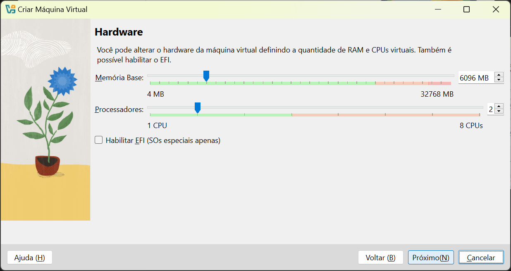

# Instalação do Virtual Box no Windows

> https://www.virtualbox.org/wiki/Downloads

## Criar uma VM Ubuntu

## VirtualBox Extension Pack

## Para maximizar a tela Crtl da direita + a tecla F

Inversão de controlo é um princípio de design de programas de computadores onde a sequência de chamadas dos métodos é invertida em relação à programação tradicional, ou seja, ela não é determinada diretamente pelo programador.

