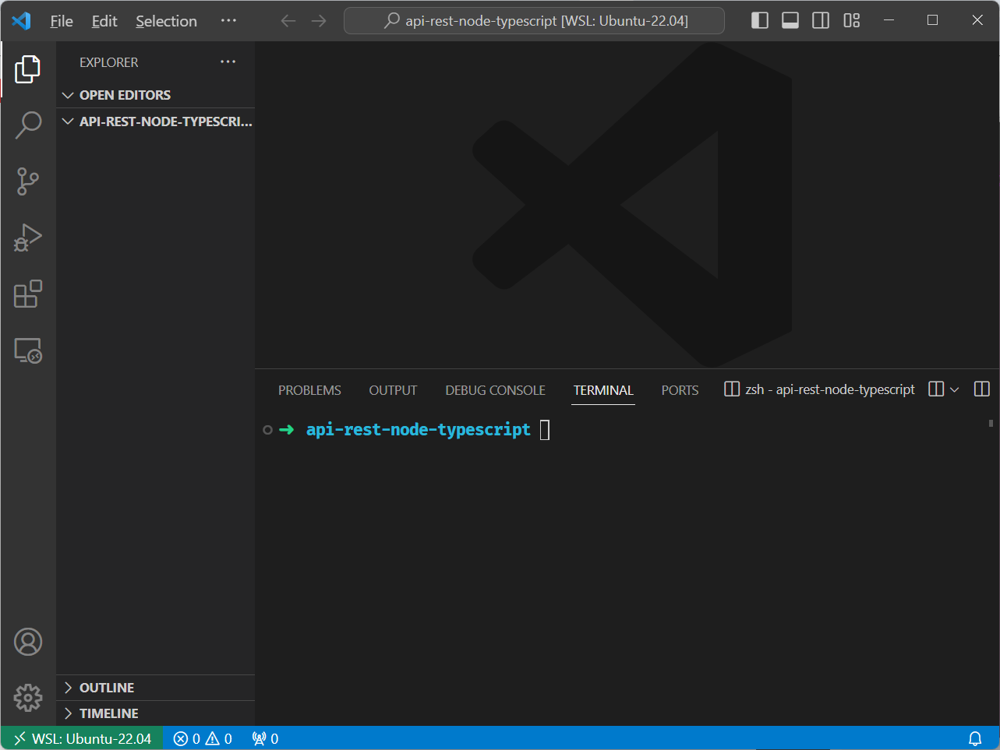
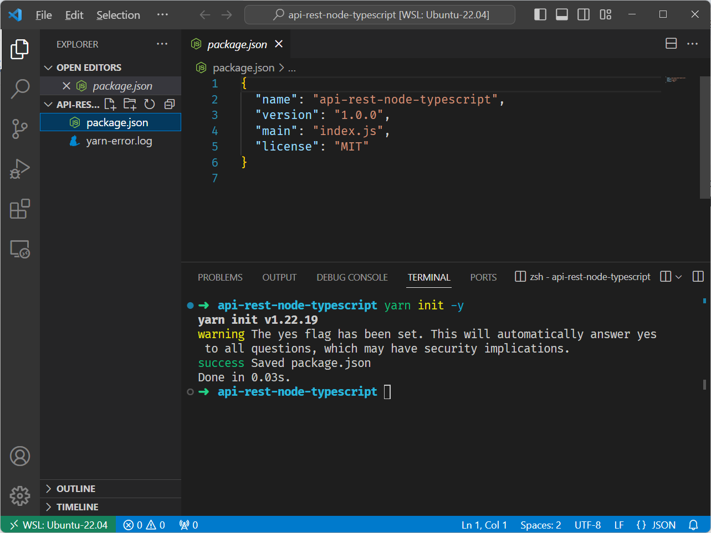

# NodeJS, Typescript e React

## NodeJS
> Instalação do Node com NVM a última versão estável "nvm install node"

```
➜  ~ nvm install node
Downloading and installing node v21.5.0...
Downloading https://nodejs.org/dist/v21.5.0/node-v21.5.0-linux-x64.tar.xz...
####################################################################################################### 100.0%
Computing checksum with sha256sum
Checksums matched!
Now using node v21.5.0 (npm v10.2.4)
Creating default alias: default -> node (-> v21.5.0)
```
> Outras versões só digitar "nvm install <numero_da_versão>"

```
nvm install 14.7.0 # or 16.3.0, 12.22.1, etc
```
> Visualizar a versão do Node e NPM

```
➜  ~ node --version
v21.5.0
```

```
➜  ~ npm --version
10.2.4
```

```
➜  ~ yarn --version
1.22.19
```
## Instalação do PNPM

> Instalação com NPM

```
➜  ~ npm install -g pnpm

added 1 package in 2s

1 package is looking for funding
  run `npm fund` for details
npm notice
npm notice New patch version of npm available! 10.2.4 -> 10.2.5
npm notice Changelog: https://github.com/npm/cli/releases/tag/v10.2.5
npm notice Run npm install -g npm@10.2.5 to update!
npm notice
```
> verificação da versão

```
➜  ~ pnpm --version
8.13.1
```


```
➜  api-rest-node-typescript yarn init -y
yarn init v1.22.19
warning The yes flag has been set. This will automatically answer yes to all questions, which may have security implications.
success Saved package.json
Done in 0.03s.
```



## Instalação do Express

```
➜  api-rest-node-typescript yarn add express
yarn add v1.22.19
info No lockfile found.
[1/4] Resolving packages...
⠁ (node:23242) [DEP0040] DeprecationWarning: The `punycode` module is deprecated. Please use a userland alternative instead.
(Use `node --trace-deprecation ...` to show where the warning was created)
[2/4] Fetching packages...
[3/4] Linking dependencies...
[4/4] Building fresh packages...
success Saved lockfile.
success Saved 37 new dependencies.
info Direct dependencies
└─ express@4.18.2
info All dependencies
├─ accepts@1.3.8
├─ array-flatten@1.1.1
├─ body-parser@1.20.1
├─ call-bind@1.0.5
├─ content-disposition@0.5.4
├─ cookie-signature@1.0.6
├─ cookie@0.5.0
├─ define-data-property@1.1.1
├─ ee-first@1.1.1
├─ express@4.18.2
├─ finalhandler@1.2.0
├─ forwarded@0.2.0
├─ get-intrinsic@1.2.2
├─ has-proto@1.0.1
├─ has-symbols@1.0.3
├─ hasown@2.0.0
├─ inherits@2.0.4
├─ ipaddr.js@1.9.1
├─ media-typer@0.3.0
├─ merge-descriptors@1.0.1
├─ methods@1.1.2
├─ mime-db@1.52.0
├─ mime-types@2.1.35
├─ mime@1.6.0
├─ ms@2.0.0
├─ negotiator@0.6.3
├─ object-inspect@1.13.1
├─ path-to-regexp@0.1.7
├─ proxy-addr@2.0.7
├─ raw-body@2.5.1
├─ safer-buffer@2.1.2
├─ serve-static@1.15.0
├─ set-function-length@1.1.1
├─ side-channel@1.0.4
├─ toidentifier@1.0.1
├─ utils-merge@1.0.1
└─ vary@1.1.2
Done in 7.20s.
```
## Instalação do Typescript e TSNode 
```
➜  api-rest-node-typescript yarn add --dev typescript @types/express ts-node-dev
yarn add v1.22.19
[1/4] Resolving packages...
⠁ (node:31153) [DEP0040] DeprecationWarning: The `punycode` module is deprecated. Please use a userland alternative instead.
(Use `node --trace-deprecation ...` to show where the warning was created)
[2/4] Fetching packages...
[3/4] Linking dependencies...
warning "ts-node-dev > ts-node@10.9.2" has unmet peer dependency "@types/node@*".
[4/4] Building fresh packages...
success Saved lockfile.
success Saved 69 new dependencies.
info Direct dependencies
├─ @types/express@4.17.21
├─ ts-node-dev@2.0.0
└─ typescript@5.3.3
info All dependencies
├─ @cspotcode/source-map-support@0.8.1
├─ @jridgewell/resolve-uri@3.1.1
├─ @jridgewell/sourcemap-codec@1.4.15
├─ @jridgewell/trace-mapping@0.3.9
├─ @tsconfig/node10@1.0.9
├─ @tsconfig/node12@1.0.11
├─ @tsconfig/node14@1.0.3
├─ @tsconfig/node16@1.0.4
├─ @types/body-parser@1.19.5
├─ @types/connect@3.4.38
├─ @types/express-serve-static-core@4.17.41
├─ @types/express@4.17.21
├─ @types/http-errors@2.0.4
├─ @types/mime@3.0.4
├─ @types/range-parser@1.2.7
├─ @types/send@0.17.4
├─ @types/serve-static@1.15.5
├─ @types/strip-bom@3.0.0
├─ @types/strip-json-comments@0.0.30
├─ acorn-walk@8.3.1
├─ acorn@8.11.3
├─ anymatch@3.1.3
├─ arg@4.1.3
├─ balanced-match@1.0.2
├─ binary-extensions@2.2.0
├─ brace-expansion@1.1.11
├─ braces@3.0.2
├─ buffer-from@1.1.2
├─ chokidar@3.5.3
├─ concat-map@0.0.1
├─ create-require@1.1.1
├─ diff@4.0.2
├─ dynamic-dedupe@0.3.0
├─ fill-range@7.0.1
├─ fs.realpath@1.0.0
├─ glob-parent@5.1.2
├─ glob@7.2.3
├─ inflight@1.0.6
├─ is-binary-path@2.1.0
├─ is-core-module@2.13.1
├─ is-extglob@2.1.1
├─ is-glob@4.0.3
├─ is-number@7.0.0
├─ make-error@1.3.6
├─ minimatch@3.1.2
├─ minimist@1.2.8
├─ mkdirp@1.0.4
├─ normalize-path@3.0.0
├─ path-is-absolute@1.0.1
├─ path-parse@1.0.7
├─ picomatch@2.3.1
├─ readdirp@3.6.0
├─ resolve@1.22.8
├─ rimraf@2.7.1
├─ source-map-support@0.5.21
├─ source-map@0.6.1
├─ strip-bom@3.0.0
├─ strip-json-comments@2.0.1
├─ supports-preserve-symlinks-flag@1.0.0
├─ to-regex-range@5.0.1
├─ tree-kill@1.2.2
├─ ts-node-dev@2.0.0
├─ ts-node@10.9.2
├─ tsconfig@7.0.0
├─ typescript@5.3.3
├─ undici-types@5.26.5
├─ v8-compile-cache-lib@3.0.1
├─ xtend@4.0.2
└─ yn@3.1.1
Done in 15.35s.
```
## Instalação do Typescript e ts-node-dev

```sh
➜  api-rest-node-typescript yarn add --dev typescript @types/express ts-node-dev
yarn add v1.22.19
[1/4] Resolving packages...
⠁ (node:105977) [DEP0040] DeprecationWarning: The `punycode` module is deprecated. Please use a userland alternative instead.
(Use `node --trace-deprecation ...` to show where the warning was created)
[2/4] Fetching packages...
[3/4] Linking dependencies...
warning "ts-node-dev > ts-node@10.9.2" has unmet peer dependency "@types/node@*".
[4/4] Building fresh packages...

success Saved 3 new dependencies.
info Direct dependencies
├─ @types/express@4.17.21
├─ ts-node-dev@2.0.0
└─ typescript@5.3.3
info All dependencies
├─ @types/express@4.17.21
├─ ts-node-dev@2.0.0
└─ typescript@5.3.3
Done in 3.33s.
```
## Rodar o APP com ts-node-dev

```
➜  api-rest-node-typescript yarn ts-node-dev ./src/index.ts 
yarn run v1.22.19
$ /home/lesp/cursos-estudos/Diversos-web/Youtube/Lucas_Souza_Dev/git-versions/api-rest-node-typescript/node_modules/.bin/ts-node-dev ./src/index.ts
[INFO] 23:16:02 ts-node-dev ver. 2.0.0 (using ts-node ver. 10.9.2, typescript ver. 5.3.3)
App rodando!
```

