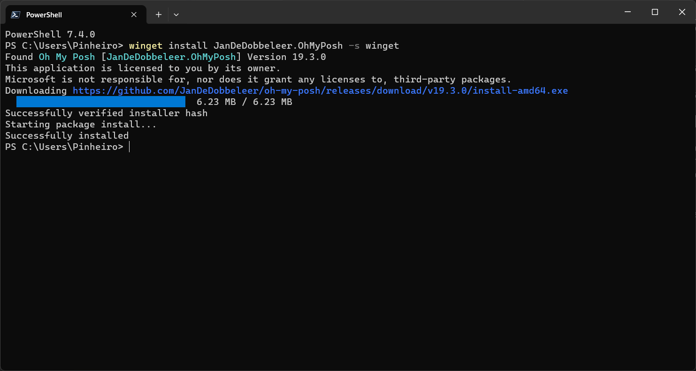
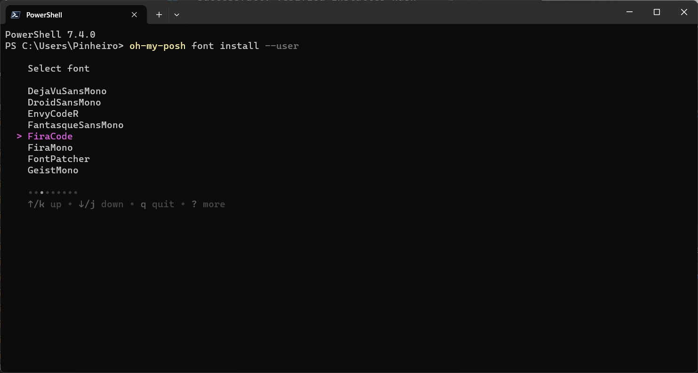
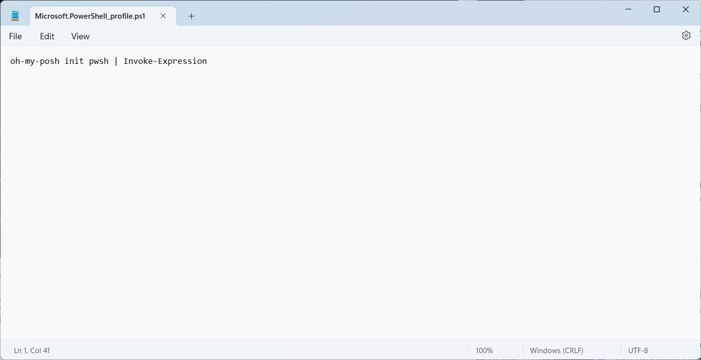
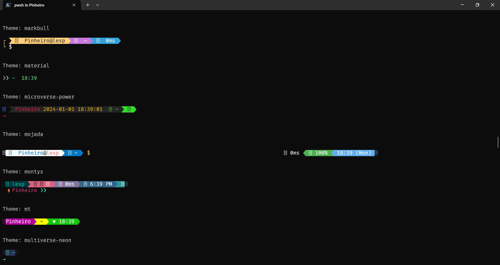

## Instalação do OhMyPosh para estilizar o terminal do Windows


> Instalação do OhMyPosh através do terminal com Winget

```
> winget install JanDeDobbeleer.OhMyPosh -s winget
Encontrado Oh My Posh [JanDeDobbeleer.OhMyPosh] Versão 19.18.1
Este aplicativo é licenciado para você pelo proprietário.
A Microsoft não é responsável por, nem concede licenças a pacotes de terceiros.
Baixando https://github.com/JanDeDobbeleer/oh-my-posh/releases/download/v19.18.1/install-amd64.exe
  ██████████████████████████████  6.32 MB / 6.32 MB
Hash do instalador verificado com êxito
Iniciando a instalação do pacote...
Instalado com êxito
```


> Após a instalação, fechar o terminal e reabrí-lo novamente

> Agora é preciso instalar alguma das Nerds fonts https://www.nerdfonts.com/

> É possível fazer o download e instalar ou pelo próprio terminal descendo ocm a seta até a fonte desejada, no meu caso escolhi a Firecode

```sh
oh-my-posh font install --user
```


>


> Esse erro ocorre devido a não abrir não reabrir o terminal


> Fechar novamente e abri como administrador e seguir os passos das imagens abaixo




> Pesonalizar com um tema desejado https://ohmyposh.dev/docs/themes

> Erro de configuração



## Fira code ligaduras de caracteres

> Fazer o download no link https://github.com/tonsky/FiraCode?tab=readme-ov-file

> Abrir a pasta 


> Abrir o arquivo de configuração do VSCode


> Inserir os seguintes dados

```sh
  "editor.fontFamily": "Fira Code",
  "editor.fontSize": 12,
  "editor.fontLigatures": true
```
> Reiniciar o VSCode

Exemplos:

=> >= <= <> => ->> := == === >>>
!=(interrogação mais igual)


## OHMyPosh esta em constantes mudanças

> https://ohmyposh.dev/docs/installation/prompt


> Perfil carregado


> Para customizar

> https://ohmyposh.dev/docs/installation/customize


