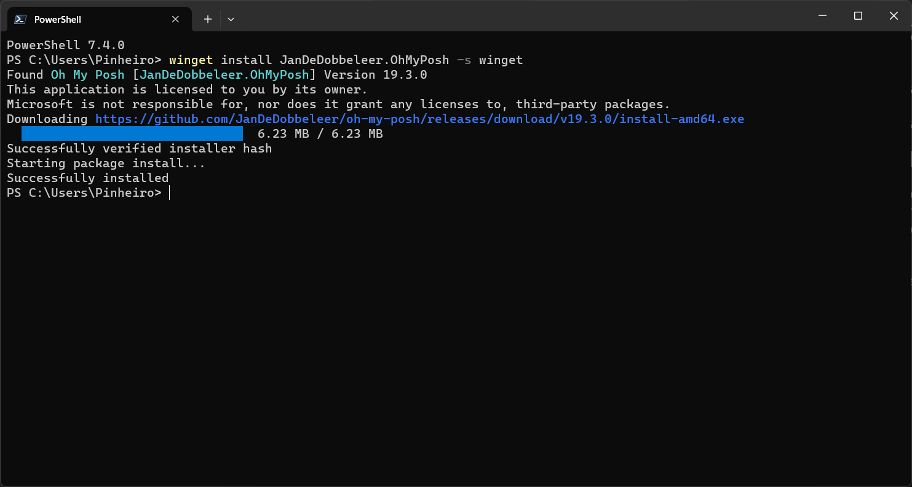
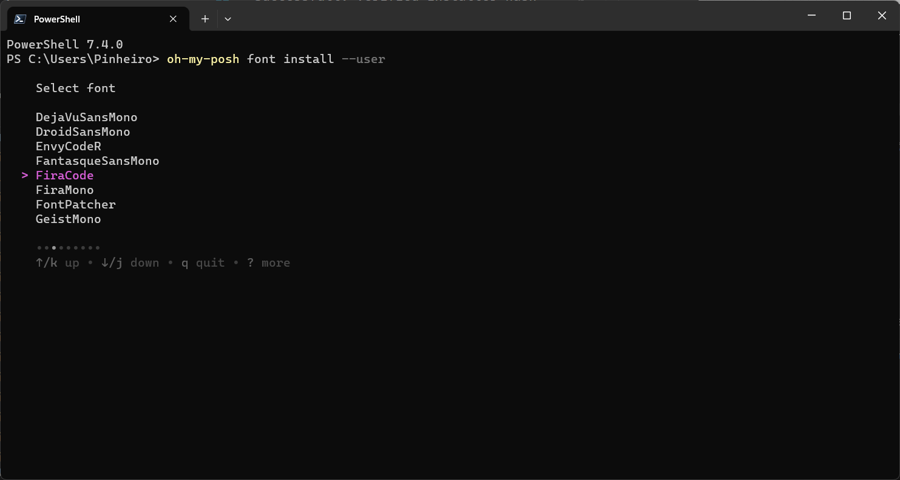
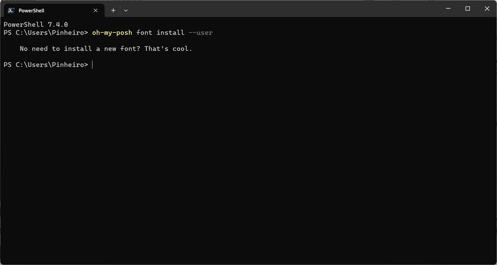
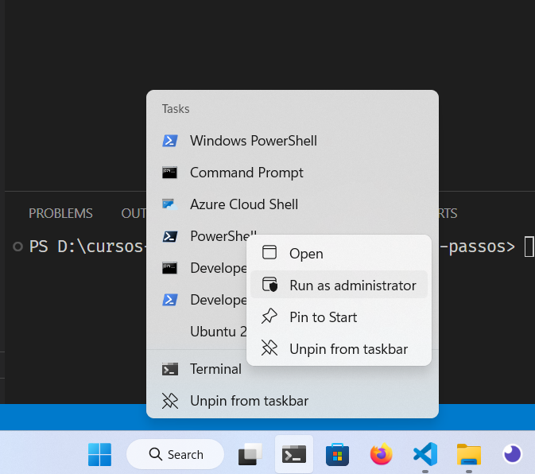
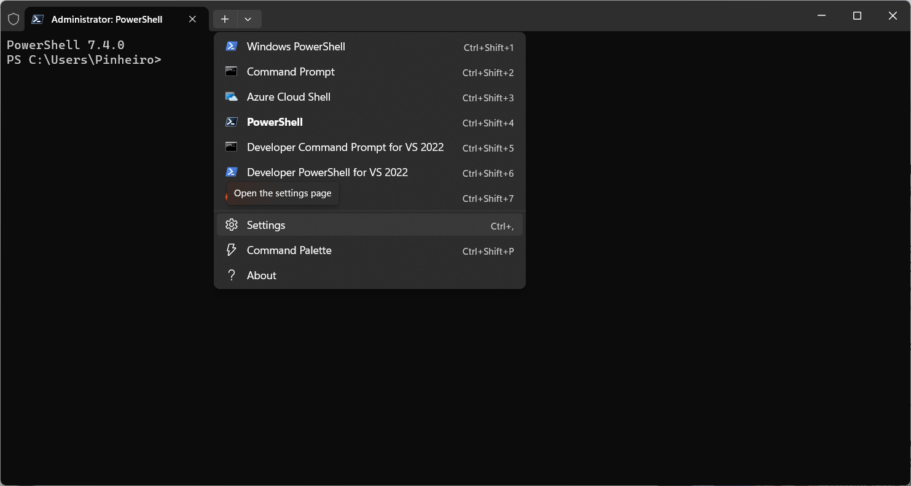
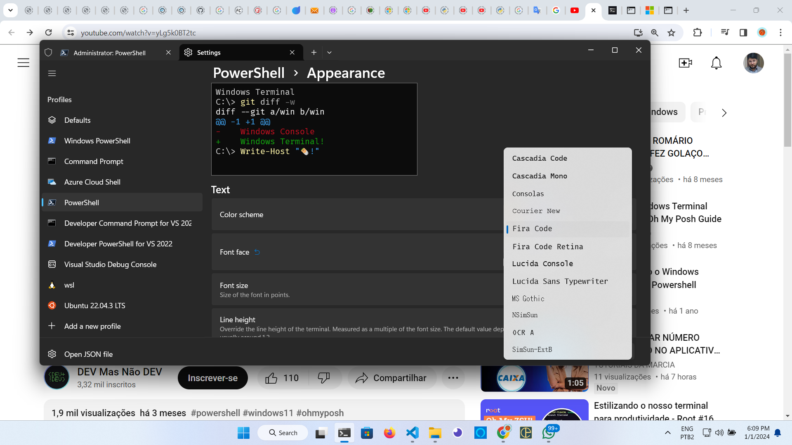
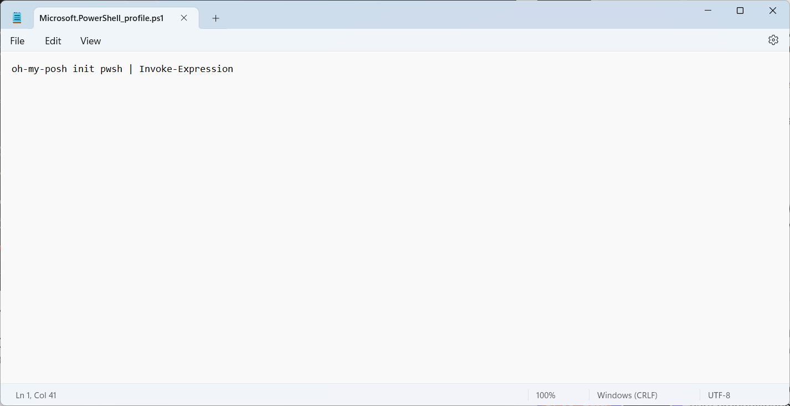
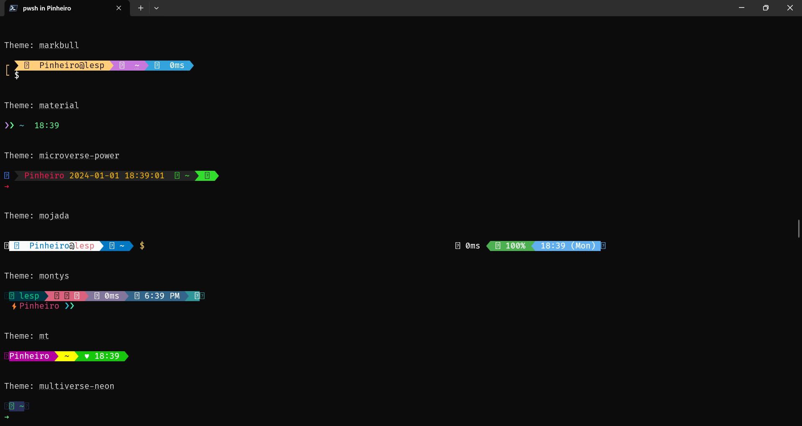

## Instalação do OhMyPoshi para estilizar o terminal do Windows

> Instalação do OhMyPoshi através do terminal com Winget

```
 winget install JanDeDobbeleer.OhMyPosh -s winget
Found Oh My Posh [JanDeDobbeleer.OhMyPosh] Version 19.3.0
This application is licensed to you by its owner.
Microsoft is not responsible for, nor does it grant any licenses to, third-party packages.
Downloading https://github.com/JanDeDobbeleer/oh-my-posh/releases/download/v19.3.0/install-amd64.exe
  ██████████████████████████████  6.23 MB / 6.23 MB
Successfully verified installer hash
Starting package install...
Successfully installed
```


> Após a instalação, fechar o terminal e reabrí-lo novamente

> Agora é preciso instalar alguma das Nerds fonts https://www.nerdfonts.com/

> É possível fazer o download e instalar ou pelo próprio terminal descendo ocm a seta até a fonte desejada, no meu caso escolhi a Firecode

```
oh-my-posh font install --user
```




> Fechar novamente e abri como administrador e seguir os passos das imagens abaixo









> Pesonalizar com um thema desejado https://ohmyposh.dev/docs/themes

> Erro de configuração



