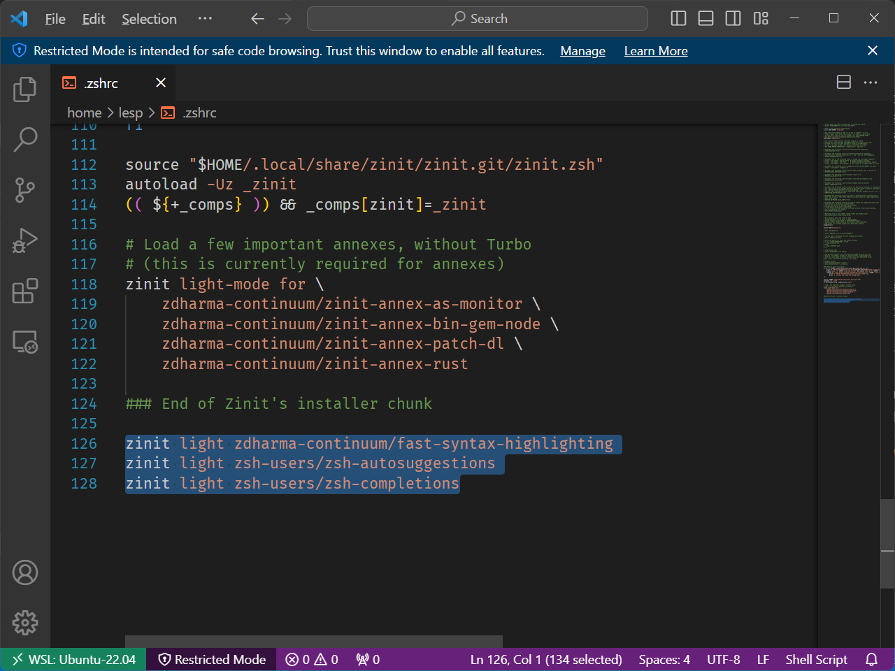
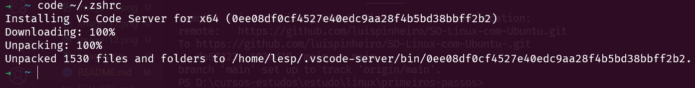
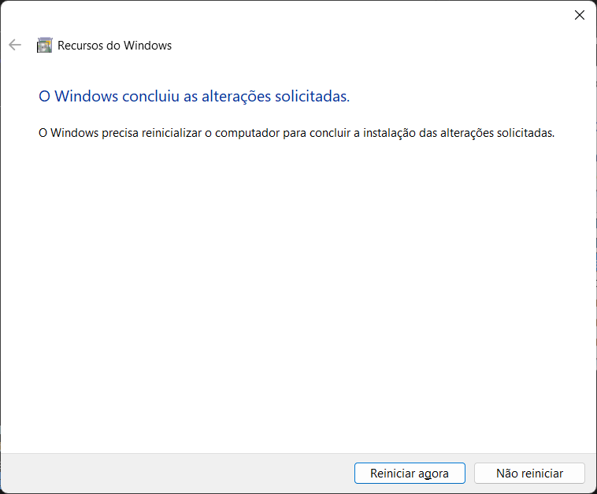

# Como utilizar o Windows Sandbox área resitrita do Windows

> Habilitar Área restrita do Windows

> Clicar em OK

> reiniciar o computador

> Procurar pelo software Sandbox

> Software iniciado

> gerenciador de dispositivos

> Atualizar drivers

> Copiar softwares

> Não foi possível resolver os problemas no gerenciador de dispositivos

