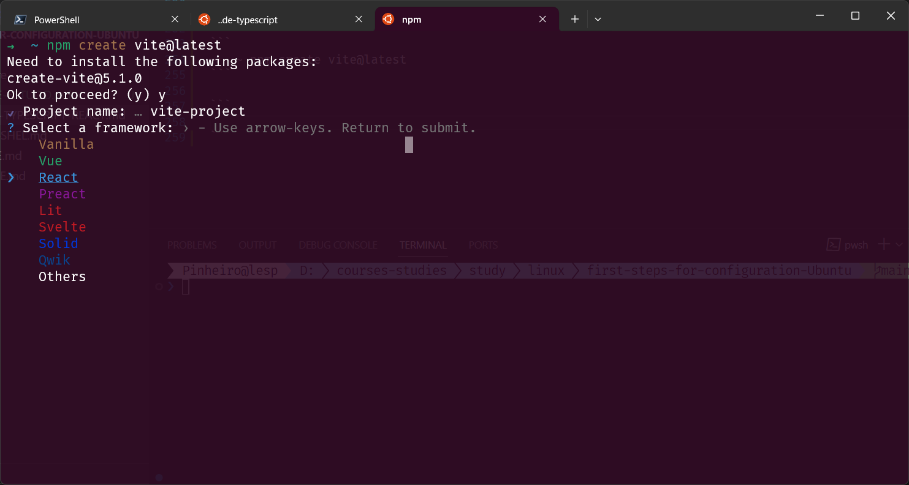

### NodeJS-Vite-React

> iniciar a criação do projeto, escolher qual o Framework utilizar

```sh
➜  ~ npm create vite@latest
Need to install the following packages:
create-vite@5.1.0
Ok to proceed? (y) y
✔ Project name: … vite-project
? Select a framework: › - Use arrow-keys. Return to submit.
    Vanilla
    Vue
❯   React
    Preact
    Lit
    Svelte
    Solid
    Qwik
    Others
```



> Escolher o nome do projeto e qual a opção de variante escolher, nesse caso pode-se escolher qualquer uma, nesse caso será o Javascript.

```sh
➜  ~ npm create vite@latest
Need to install the following packages:
create-vite@5.1.0
Ok to proceed? (y) y
✔ Project name: … vite-project
✔ Select a framework: › React
? Select a variant: › - Use arrow-keys. Return to submit.
    TypeScript
    TypeScript + SWC
❯   JavaScript
    JavaScript + SWC
```

> Escolher qual o comando utilizar, primeiramente acessar o diretório e depois instalar as dependências

> Assim como andaimes(scaffolding) são usados na construção de edifícios para fornecer suporte temporário aos trabalhadores, o scaffolding em programação é um conjunto de ferramentas, estruturas de código ou frameworks que ajudam os desenvolvedores a iniciar e a desenvolver um projeto de software de maneira mais rápida e eficiente.

```sh
➜  ~ npm create vite@latest
Need to install the following packages:
create-vite@5.1.0
Ok to proceed? (y) y
✔ Project name: … vite-project
✔ Select a framework: › React
✔ Select a variant: › JavaScript

Scaffolding project in /home/lesp/vite-project...

Done. Now run:

  cd vite-project
  npm install
  npm run dev
```

> Acessar o diretório do projeto

```sh
➜  ~ cd vite-project
```

> Instalar as dependências com o gerenciador de pacotes Node.

```sh
➜  vite-project npm install

added 270 packages, and audited 271 packages in 2m

97 packages are looking for funding
  run `npm fund` for details

found 0 vulnerabilities
```
