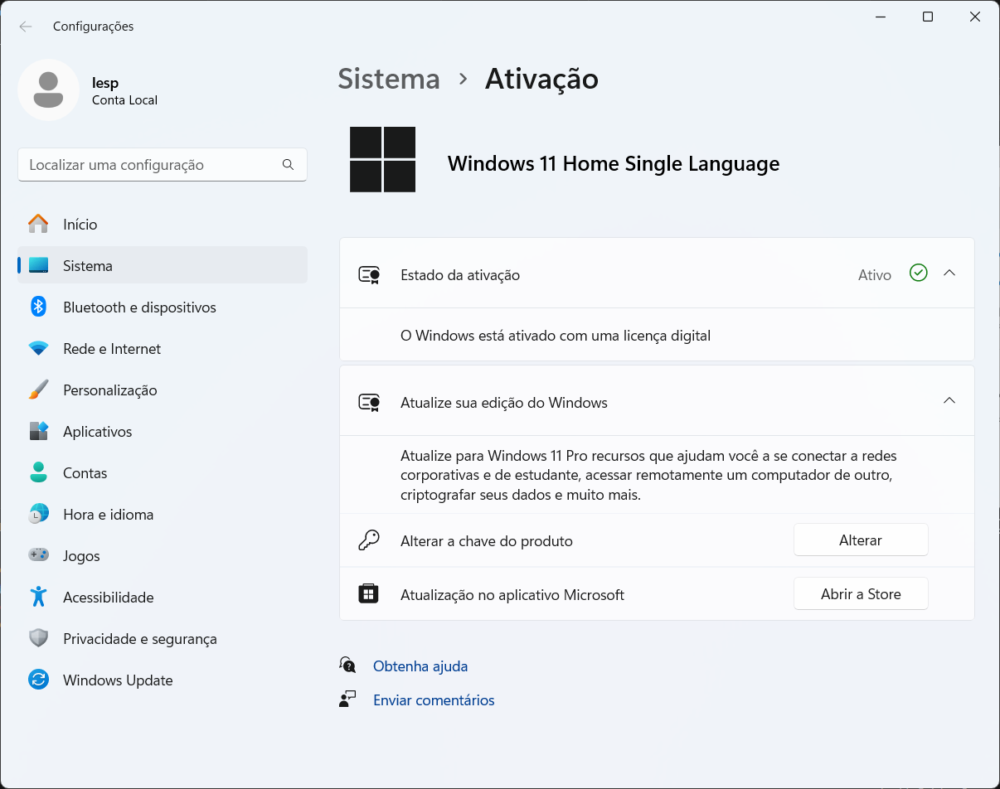
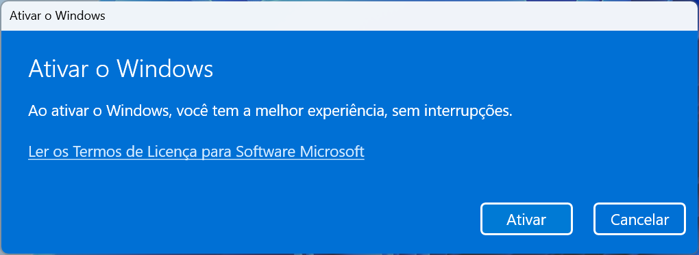
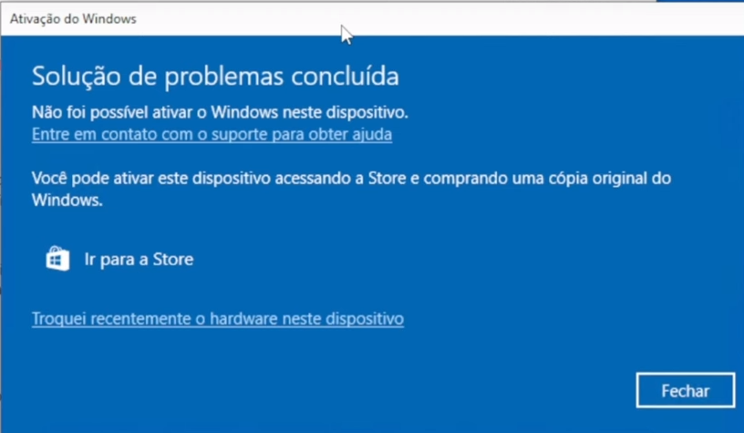
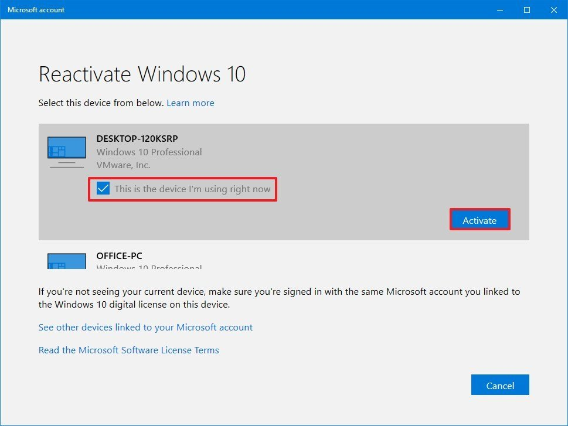

# Como alterar a edição do Windows Home para o Professional

## Passo a passo

> Digitar no menu iniciar <mark>**Alterar chave do produto**<mark>

> Alterar chave

> Inserir a serial compatível com Windows Pro

> Cicar em Ativar

> Fechar a janela

> Reiniciar o PC

## Outro método

> É possível localizar uma chave através do seu email já utilizado anteriormente de ativações antigas.

> Clicar em Troquei recentemente o hardware deste dispositivo

> Escolher a edição desejada.

> Se o computador não aparecer na lista, clique no botão Veja outros dispositivos vinculados à sua conta da Microsoft opção e, em seguida, selecione o dispositivo.