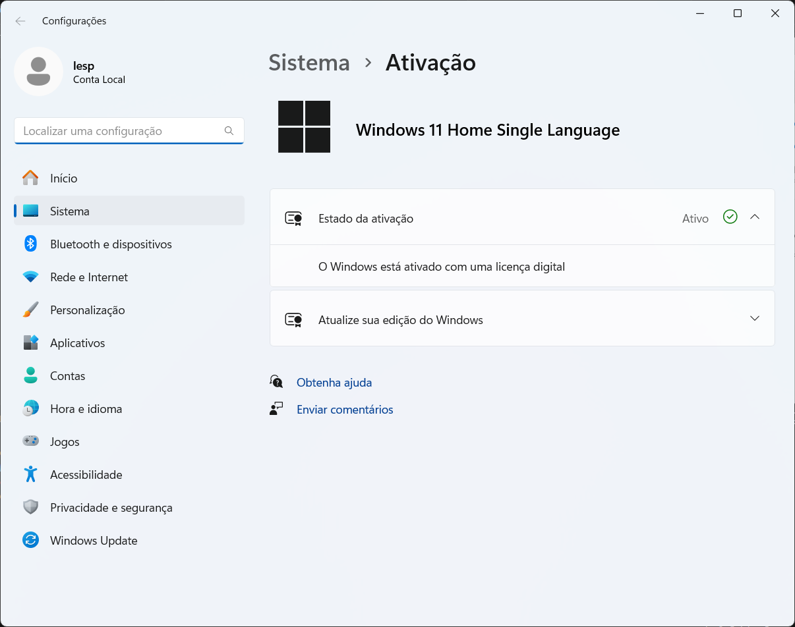
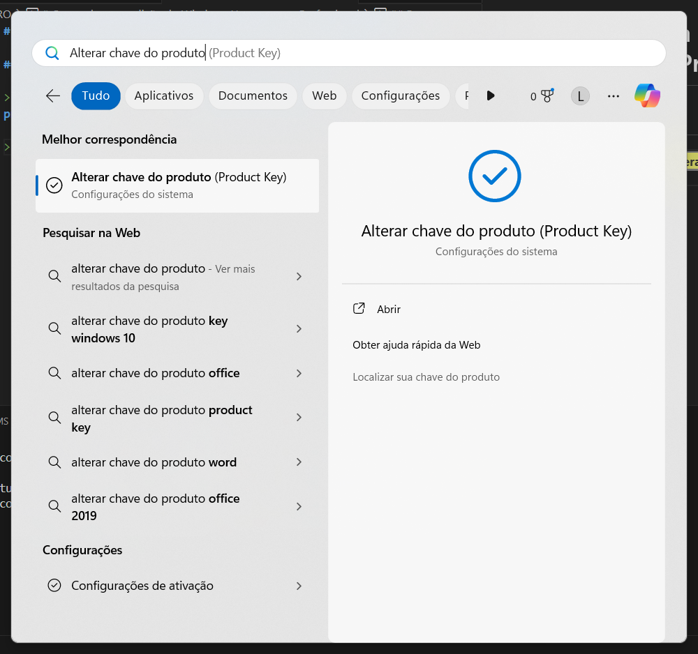

## Como habilitar o WSL2 no Windows

> Pode ser instalado de duas maneiras, pelo terminal ou diretamente na Microsoft Store

```
wsl --install
```


> Entrar no Microsoft Store

> instalar a dstribuição Ubuntu





> Para visualizar as distros instaladas no terminnal

```
wsl -l -v
```


> Para acessar a distro é preciso dar o nome de usuário e senha do usuário root.


> Inserir os dados de configuração do Git

```sh
git config --global user.name "user Eduardo dos S Pinheiro"
```
```sh
git config --global user.email "email@provedor.com"
```
> Para gerar a chave SSH

Site do Github: https://docs.github.com/en/authentication/connecting-to-github-with-ssh/generating-a-new-ssh-key-and-adding-it-to-the-ssh-agent

```sh
ssh-keygen -t ed25519 -C "email@provedor.com"
Generating public/private ed25519 key pair.
Enter file in which to save the key (/home/lesp/.ssh/id_ed25519):
Created directory '/home/lesp/.ssh'.
Enter passphrase (empty for no passphrase):
Enter same passphrase again:
Your identification has been saved in /home/lesp/.ssh/id_ed25519
Your public key has been saved in /home/lesp/.ssh/id_ed25519.pub
The key fingerprint is:
SHA256:0IGK4HsnkUrRm/3Mv0w0KNdy8bpkKYKDUjeeNCnXJGg email@provedor.com
The key's randomart image is:
+--[ED25519 256]--+
|  .    ..        |
|.. o  .. .       |
|..E.*.o ..       |
| +.=.* .o o      |
|. = O.=+S= .     |
| +.O.=o++ +      |
|...o=. ..*       |
|.   . . *..      |
|         +.      |
+----[SHA256]-----+
```
> Para visualizar a chave SSH

```sh
~$ ls -al ~/.ssh
total 16
drwx------ 2 lesp lesp 4096 Dec 28 16:10 .
drwxr-x--- 4 lesp lesp 4096 Dec 28 16:10 ..
-rw------- 1 lesp lesp  419 Dec 28 16:10 id_ed25519
-rw-r--r-- 1 lesp lesp  108 Dec 28 16:10 id_ed25519.pub
lesp@lesp:~$ cat .ssh/id_ed25519.pub
ssh-ed25519 XXXXXXXXXXXXXXXXXXXXXXXXXXXXXXXXXX/XXXXXXXXXXXXXXXXXXXXXXXXXXXXXXXXXX email@provedor.com
```
[ssh-wsl-local](SSH-WSL.md)


## Instalação do ZSH

```sh
~$ sudo apt install zsh
[sudo] password for lesp:
Reading package lists... Done
Building dependency tree... Done
Reading state information... Done
The following additional packages will be installed:
  zsh-common
Suggested packages:
  zsh-doc
The following NEW packages will be installed:
  zsh zsh-common
0 upgraded, 2 newly installed, 0 to remove and 5 not upgraded.
Need to get 4794 kB of archives.
After this operation, 18.2 MB of additional disk space will be used.
Do you want to continue? [Y/n] y
Get:1 http://archive.ubuntu.com/ubuntu jammy/main amd64 zsh-common all 5.8.1-1 [3985 kB]
Get:2 http://archive.ubuntu.com/ubuntu jammy/main amd64 zsh amd64 5.8.1-1 [809 kB]
Fetched 4794 kB in 3s (1882 kB/s)
Selecting previously unselected package zsh-common.
(Reading database ... 24257 files and directories currently installed.)
Preparing to unpack .../zsh-common_5.8.1-1_all.deb ...
Unpacking zsh-common (5.8.1-1) ...
Selecting previously unselected package zsh.
Preparing to unpack .../archives/zsh_5.8.1-1_amd64.deb ...
Unpacking zsh (5.8.1-1) ...
Setting up zsh-common (5.8.1-1) ...
Setting up zsh (5.8.1-1) ...
Processing triggers for man-db (2.10.2-1) ..
```

```sh
$ zsh --version
zsh 5.8.1 (x86_64-ubuntu-linux-gnu)
```

```sh
~$ git config --list
user.name=user Luis Eduardo dos S Pinheiro
user.email=email@provedor.com
```

## Instalação do OhMyZSH

```sh
$ sh -c "$(curl -fsSL https://raw.githubusercontent.com/ohmyzsh/ohmyzsh/master/tools/install.sh)"
Cloning Oh My Zsh...
remote: Enumerating objects: 1393, done.
remote: Counting objects: 100% (1393/1393), done.
remote: Compressing objects: 100% (1327/1327), done.
remote: Total 1393 (delta 46), reused 1131 (delta 41), pack-reused 0
Receiving objects: 100% (1393/1393), 3.20 MiB | 4.31 MiB/s, done.
Resolving deltas: 100% (46/46), done.
From https://github.com/ohmyzsh/ohmyzsh
 * [new branch]      master                      -> origin/master
 * [new branch]      update/plugins/gitfast/v2.0 -> origin/update/plugins/gitfast/v2.0
 * [new branch]      update/plugins/z/afaf2965   -> origin/update/plugins/z/afaf2965
Branch 'master' set up to track remote branch 'master' from 'origin'.
Already on 'master'
/home/lesp

Looking for an existing zsh config...
Using the Oh My Zsh template file and adding it to /home/lesp/.zshrc.

Time to change your default shell to zsh:
Do you want to change your default shell to zsh? [Y/n] y
Changing your shell to /usr/bin/zsh...
[sudo] password for lesp:
Shell successfully changed to '/usr/bin/zsh'.

         __                                     __
  ____  / /_     ____ ___  __  __   ____  _____/ /_
 / __ \/ __ \   / __ `__ \/ / / /  /_  / / ___/ __ \
/ /_/ / / / /  / / / / / / /_/ /    / /_(__  ) / / /
\____/_/ /_/  /_/ /_/ /_/\__, /    /___/____/_/ /_/
                        /____/                       ....is now installed!


Before you scream Oh My Zsh! look over the `.zshrc` file to select plugins, themes, and options.

• Follow us on Twitter: @ohmyzsh
• Join our Discord community: Discord server
• Get stickers, t-shirts, coffee mugs and more: Planet Argon Shop
```


