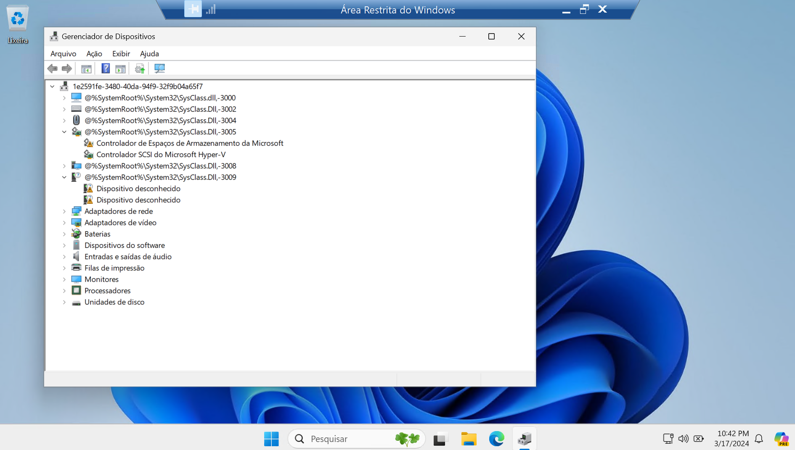

## Como habilitar o WSL2 no Windows

> Pode ser instalado de duas maneiras, pelo terminal ou diretamente na Microsoft Store

```
wsl --install
```


> Entrar no Microsoft Store

> instalar a dstribuição Ubuntu


> Para visualizar as distros instaladas no terminnal

```
wsl -l -v
```


> Para acessar a distro é preciso dar o nome de usuário e senha do usuário root.


> Inserir os dados de configuração do Git

```sh
git config --global user.name "user Eduardo dos S Pinheiro"
```
```sh
git config --global user.email "email@provedor.com"
```
> Para gerar a chave SSH

Site do Github: https://docs.github.com/en/authentication/connecting-to-github-with-ssh/generating-a-new-ssh-key-and-adding-it-to-the-ssh-agent

```sh
ssh-keygen -t ed25519 -C "email@provedor.com"
Generating public/private ed25519 key pair.
Enter file in which to save the key (/home/lesp/.ssh/id_ed25519):
Created directory '/home/lesp/.ssh'.
Enter passphrase (empty for no passphrase):
Enter same passphrase again:
Your identification has been saved in /home/lesp/.ssh/id_ed25519
Your public key has been saved in /home/lesp/.ssh/id_ed25519.pub
The key fingerprint is:
SHA256:0IGK4HsnkUrRm/3Mv0w0KNdy8bpkKYKDUjeeNCnXJGg email@provedor.com
The key's randomart image is:
+--[ED25519 256]--+
|  .    ..        |
|.. o  .. .       |
|..E.*.o ..       |
| +.=.* .o o      |
|. = O.=+S= .     |
| +.O.=o++ +      |
|...o=. ..*       |
|.   . . *..      |
|         +.      |
+----[SHA256]-----+
```
> Para visualizar a chave SSH

```sh
~$ ls -al ~/.ssh
total 16
drwx------ 2 lesp lesp 4096 Dec 28 16:10 .
drwxr-x--- 4 lesp lesp 4096 Dec 28 16:10 ..
-rw------- 1 lesp lesp  419 Dec 28 16:10 id_ed25519
-rw-r--r-- 1 lesp lesp  108 Dec 28 16:10 id_ed25519.pub
lesp@lesp:~$ cat .ssh/id_ed25519.pub
ssh-ed25519 XXXXXXXXXXXXXXXXXXXXXXXXXXXXXXXXXX/XXXXXXXXXXXXXXXXXXXXXXXXXXXXXXXXXX email@provedor.com
```
[ssh-wsl-local](SSH-WSL.md)


## Instalação do ZSH

```sh
~$ sudo apt install zsh
[sudo] password for lesp:
Reading package lists... Done
Building dependency tree... Done
Reading state information... Done
The following additional packages will be installed:
  zsh-common
Suggested packages:
  zsh-doc
The following NEW packages will be installed:
  zsh zsh-common
0 upgraded, 2 newly installed, 0 to remove and 5 not upgraded.
Need to get 4794 kB of archives.
After this operation, 18.2 MB of additional disk space will be used.
Do you want to continue? [Y/n] y
Get:1 http://archive.ubuntu.com/ubuntu jammy/main amd64 zsh-common all 5.8.1-1 [3985 kB]
Get:2 http://archive.ubuntu.com/ubuntu jammy/main amd64 zsh amd64 5.8.1-1 [809 kB]
Fetched 4794 kB in 3s (1882 kB/s)
Selecting previously unselected package zsh-common.
(Reading database ... 24257 files and directories currently installed.)
Preparing to unpack .../zsh-common_5.8.1-1_all.deb ...
Unpacking zsh-common (5.8.1-1) ...
Selecting previously unselected package zsh.
Preparing to unpack .../archives/zsh_5.8.1-1_amd64.deb ...
Unpacking zsh (5.8.1-1) ...
Setting up zsh-common (5.8.1-1) ...
Setting up zsh (5.8.1-1) ...
Processing triggers for man-db (2.10.2-1) ..
```

```sh
$ zsh --version
zsh 5.8.1 (x86_64-ubuntu-linux-gnu)
```

```sh
~$ git config --list
user.name=user Luis Eduardo dos S Pinheiro
user.email=email@provedor.com
```

## Instalação do OhMyZSH

```sh
$ sh -c "$(curl -fsSL https://raw.githubusercontent.com/ohmyzsh/ohmyzsh/master/tools/install.sh)"
Cloning Oh My Zsh...
remote: Enumerating objects: 1393, done.
remote: Counting objects: 100% (1393/1393), done.
remote: Compressing objects: 100% (1327/1327), done.
remote: Total 1393 (delta 46), reused 1131 (delta 41), pack-reused 0
Receiving objects: 100% (1393/1393), 3.20 MiB | 4.31 MiB/s, done.
Resolving deltas: 100% (46/46), done.
From https://github.com/ohmyzsh/ohmyzsh
 * [new branch]      master                      -> origin/master
 * [new branch]      update/plugins/gitfast/v2.0 -> origin/update/plugins/gitfast/v2.0
 * [new branch]      update/plugins/z/afaf2965   -> origin/update/plugins/z/afaf2965
Branch 'master' set up to track remote branch 'master' from 'origin'.
Already on 'master'
/home/lesp

Looking for an existing zsh config...
Using the Oh My Zsh template file and adding it to /home/lesp/.zshrc.

Time to change your default shell to zsh:
Do you want to change your default shell to zsh? [Y/n] y
Changing your shell to /usr/bin/zsh...
[sudo] password for lesp:
Shell successfully changed to '/usr/bin/zsh'.

         __                                     __
  ____  / /_     ____ ___  __  __   ____  _____/ /_
 / __ \/ __ \   / __ `__ \/ / / /  /_  / / ___/ __ \
/ /_/ / / / /  / / / / / / /_/ /    / /_(__  ) / / /
\____/_/ /_/  /_/ /_/ /_/\__, /    /___/____/_/ /_/
                        /____/                       ....is now installed!


Before you scream Oh My Zsh! look over the `.zshrc` file to select plugins, themes, and options.

• Follow us on Twitter: @ohmyzsh
• Join our Discord community: Discord server
• Get stickers, t-shirts, coffee mugs and more: Planet Argon Shop
```


> Extensão WSL para utilizar o VSCode


> A quina inferior direita na cor verde mostra que estamos conectados no WSL



> Clicando no ícone lateral esquerdo com símbolo de monitor, vemos as distros e o Docker instalado.


## Plugins para OHMyZSH

> Acessar o link: https://gist.github.com/n1snt/454b879b8f0b7995740ae04c5fb5b7df

autosuggesions plugin

```
git clone https://github.com/zsh-users/zsh-autosuggestions.git $ZSH_CUSTOM/plugins/zsh-autosuggestions
```

zsh-syntax-highlighting plugin

```
git clone https://github.com/zsh-users/zsh-syntax-highlighting.git $ZSH_CUSTOM/plugins/zsh-syntax-highlighting
```

zsh-fast-syntax-highlighting plugin

```
git clone https://github.com/zdharma-continuum/fast-syntax-highlighting.git ${ZSH_CUSTOM:-$HOME/.oh-my-zsh/custom}/plugins/fast-syntax-highlighting

```

zsh-autocomplete plugin

```
git clone --depth 1 -- https://github.com/marlonrichert/zsh-autocomplete.git $ZSH_CUSTOM/plugins/zsh-autocomplete
```
Inserir no arquivo .zshrc em plugin os dados

```
plugins=(git zsh-autosuggestions zsh-syntax-highlighting fast-syntax-highlighting zsh-autocomplete)
```
## Instalação do plugin nmv para NodeJS

https://github.com/lukechilds/zsh-nvm

```
➜  ~ git clone https://github.com/lukechilds/zsh-nvm ~/.oh-my-zsh/custom/plugins/zsh-nvm
Cloning into '/home/lesp/.oh-my-zsh/custom/plugins/zsh-nvm'...
remote: Enumerating objects: 583, done.
remote: Counting objects: 100% (57/57), done.
remote: Compressing objects: 100% (35/35), done.
remote: Total 583 (delta 31), reused 39 (delta 21), pack-reused 526
Receiving objects: 100% (583/583), 86.82 KiB | 2.41 MiB/s, done.
Resolving deltas: 100% (309/309), done.
```
> Inserir os dados abaixo no arquivo .zshrc

```
plugins+=(zsh-nvm)
```


## Python no WSL

> Python não veio instalado na distro Ubuntu 22.04.3 LTS

```sh
➜  ~ python
zsh: command not found: python
```

```
➜  ~ python --version
zsh: command not found: python
```

```sh
➜  ~ sudo apt install python3-pip -y
[sudo] password for lesp:
Reading package lists... Done
Building dependency tree... Done
Reading state information... Done
The following additional packages will be installed:
  build-essential bzip2 cpp cpp-11 dpkg-dev fakeroot fontconfig-config fonts-dejavu-core g++ g++-11 gcc
  gcc-11 gcc-11-base javascript-common libalgorithm-diff-perl libalgorithm-diff-xs-perl
  libalgorithm-merge-perl libasan6 libatomic1 libc-dev-bin libc-devtools libc6-dev libcc1-0 libcrypt-dev
  libdeflate0 libdpkg-perl libexpat1-dev libfakeroot libfile-fcntllock-perl libfontconfig1 libfreetype6
  libgcc-11-dev libgd3 libgomp1 libisl23 libitm1 libjbig0 libjpeg-turbo8 libjpeg8 libjs-jquery
  libjs-sphinxdoc libjs-underscore liblsan0 libmpc3 libnsl-dev libpython3-dev libpython3.10-dev libquadmath0
  libstdc++-11-dev libtiff5 libtirpc-dev libtsan0 libubsan1 libwebp7 libxpm4 linux-libc-dev
  lto-disabled-list make manpages-dev python3-dev python3-distutils python3-lib2to3 python3-setuptools
  python3-wheel python3.10-dev rpcsvc-proto zlib1g-dev
Suggested packages:
  bzip2-doc cpp-doc gcc-11-locales debian-keyring g++-multilib g++-11-multilib gcc-11-doc gcc-multilib
  autoconf automake libtool flex bison gdb gcc-doc gcc-11-multilib apache2 | lighttpd | httpd glibc-doc bzr
  libgd-tools libstdc++-11-doc make-doc python-setuptools-doc
The following NEW packages will be installed:
  build-essential bzip2 cpp cpp-11 dpkg-dev fakeroot fontconfig-config fonts-dejavu-core g++ g++-11 gcc
  gcc-11 gcc-11-base javascript-common libalgorithm-diff-perl libalgorithm-diff-xs-perl
  libalgorithm-merge-perl libasan6 libatomic1 libc-dev-bin libc-devtools libc6-dev libcc1-0 libcrypt-dev
  libdeflate0 libdpkg-perl libexpat1-dev libfakeroot libfile-fcntllock-perl libfontconfig1 libfreetype6
  libgcc-11-dev libgd3 libgomp1 libisl23 libitm1 libjbig0 libjpeg-turbo8 libjpeg8 libjs-jquery
  libjs-sphinxdoc libjs-underscore liblsan0 libmpc3 libnsl-dev libpython3-dev libpython3.10-dev libquadmath0
  libstdc++-11-dev libtiff5 libtirpc-dev libtsan0 libubsan1 libwebp7 libxpm4 linux-libc-dev
  lto-disabled-list make manpages-dev python3-dev python3-distutils python3-lib2to3 python3-pip
  python3-setuptools python3-wheel python3.10-dev rpcsvc-proto zlib1g-dev
0 upgraded, 68 newly installed, 0 to remove and 2 not upgraded.
Need to get 70.0 MB/72.3 MB of archives.
After this operation, 243 MB of additional disk space will be used.
Get:1 http://archive.ubuntu.com/ubuntu jammy-updates/main amd64 libc-dev-bin amd64 2.35-0ubuntu3.5 [20.3 kB]
Get:2 http://archive.ubuntu.com/ubuntu jammy-updates/main amd64 linux-libc-dev amd64 5.15.0-91.101 [1332 kB]
Get:3 http://archive.ubuntu.com/ubuntu jammy/main amd64 libcrypt-dev amd64 1:4.4.27-1 [112 kB]
Get:4 http://archive.ubuntu.com/ubuntu jammy/main amd64 rpcsvc-proto amd64 1.4.2-0ubuntu6 [68.5 kB]
Get:5 http://archive.ubuntu.com/ubuntu jammy-updates/main amd64 libtirpc-dev amd64 1.3.2-2ubuntu0.1 [192 kB]
Get:6 http://archive.ubuntu.com/ubuntu jammy/main amd64 libnsl-dev amd64 1.3.0-2build2 [71.3 kB]
Get:7 http://archive.ubuntu.com/ubuntu jammy-updates/main amd64 libc6-dev amd64 2.35-0ubuntu3.5 [2098 kB]
Get:8 http://archive.ubuntu.com/ubuntu jammy-updates/main amd64 gcc-11-base amd64 11.4.0-1ubuntu1~22.04 [20.2 kB]
Get:9 http://archive.ubuntu.com/ubuntu jammy/main amd64 libisl23 amd64 0.24-2build1 [727 kB]
Get:10 http://archive.ubuntu.com/ubuntu jammy/main amd64 libmpc3 amd64 1.2.1-2build1 [46.9 kB]
Get:11 http://archive.ubuntu.com/ubuntu jammy-updates/main amd64 cpp-11 amd64 11.4.0-1ubuntu1~22.04 [10.0 MB]
Get:12 http://archive.ubuntu.com/ubuntu jammy/main amd64 cpp amd64 4:11.2.0-1ubuntu1 [27.7 kB]
Get:13 http://archive.ubuntu.com/ubuntu jammy-updates/main amd64 libcc1-0 amd64 12.3.0-1ubuntu1~22.04 [48.3 kB]
Get:14 http://archive.ubuntu.com/ubuntu jammy-updates/main amd64 libgomp1 amd64 12.3.0-1ubuntu1~22.04 [126 kB]
Get:15 http://archive.ubuntu.com/ubuntu jammy-updates/main amd64 libitm1 amd64 12.3.0-1ubuntu1~22.04 [30.2 kB]
Get:16 http://archive.ubuntu.com/ubuntu jammy-updates/main amd64 libasan6 amd64 11.4.0-1ubuntu1~22.04 [2282 kB]
Get:17 http://archive.ubuntu.com/ubuntu jammy-updates/main amd64 liblsan0 amd64 12.3.0-1ubuntu1~22.04 [1069 kB]
Get:18 http://archive.ubuntu.com/ubuntu jammy-updates/main amd64 libtsan0 amd64 11.4.0-1ubuntu1~22.04 [2260 kB]
Get:19 http://archive.ubuntu.com/ubuntu jammy-updates/main amd64 libubsan1 amd64 12.3.0-1ubuntu1~22.04 [976 kB]
Get:20 http://archive.ubuntu.com/ubuntu jammy-updates/main amd64 libquadmath0 amd64 12.3.0-1ubuntu1~22.04 [154 kB]
Get:21 http://archive.ubuntu.com/ubuntu jammy-updates/main amd64 libgcc-11-dev amd64 11.4.0-1ubuntu1~22.04 [2517 kB]
Get:22 http://archive.ubuntu.com/ubuntu jammy-updates/main amd64 gcc-11 amd64 11.4.0-1ubuntu1~22.04 [20.1 MB]
Get:23 http://archive.ubuntu.com/ubuntu jammy/main amd64 gcc amd64 4:11.2.0-1ubuntu1 [5112 B]
Get:24 http://archive.ubuntu.com/ubuntu jammy-updates/main amd64 libstdc++-11-dev amd64 11.4.0-1ubuntu1~22.04 [2101 kB]
Get:25 http://archive.ubuntu.com/ubuntu jammy-updates/main amd64 g++-11 amd64 11.4.0-1ubuntu1~22.04 [11.4 MB]
Get:26 http://archive.ubuntu.com/ubuntu jammy/main amd64 g++ amd64 4:11.2.0-1ubuntu1 [1412 B]
Get:27 http://archive.ubuntu.com/ubuntu jammy/main amd64 make amd64 4.3-4.1build1 [180 kB]
Get:28 http://archive.ubuntu.com/ubuntu jammy-updates/main amd64 libdpkg-perl all 1.21.1ubuntu2.2 [237 kB]
Get:29 http://archive.ubuntu.com/ubuntu jammy/main amd64 bzip2 amd64 1.0.8-5build1 [34.8 kB]
Get:30 http://archive.ubuntu.com/ubuntu jammy/main amd64 lto-disabled-list all 24 [12.5 kB]
Get:31 http://archive.ubuntu.com/ubuntu jammy-updates/main amd64 dpkg-dev all 1.21.1ubuntu2.2 [922 kB]
Get:32 http://archive.ubuntu.com/ubuntu jammy/main amd64 build-essential amd64 12.9ubuntu3 [4744 B]
Get:33 http://archive.ubuntu.com/ubuntu jammy/main amd64 libfakeroot amd64 1.28-1ubuntu1 [31.5 kB]
Get:34 http://archive.ubuntu.com/ubuntu jammy/main amd64 fakeroot amd64 1.28-1ubuntu1 [60.4 kB]
Get:35 http://archive.ubuntu.com/ubuntu jammy/main amd64 javascript-common all 11+nmu1 [5936 B]
Get:36 http://archive.ubuntu.com/ubuntu jammy/main amd64 libalgorithm-diff-perl all 1.201-1 [41.8 kB]
Get:37 http://archive.ubuntu.com/ubuntu jammy/main amd64 libalgorithm-diff-xs-perl amd64 0.04-6build3 [11.9 kB]
Get:38 http://archive.ubuntu.com/ubuntu jammy/main amd64 libalgorithm-merge-perl all 0.08-3 [12.0 kB]
Get:39 http://archive.ubuntu.com/ubuntu jammy-updates/main amd64 libxpm4 amd64 1:3.5.12-1ubuntu0.22.04.2 [36.7 kB]
Get:40 http://archive.ubuntu.com/ubuntu jammy/main amd64 libgd3 amd64 2.3.0-2ubuntu2 [129 kB]
Get:41 http://archive.ubuntu.com/ubuntu jammy-updates/main amd64 libc-devtools amd64 2.35-0ubuntu3.5 [28.9 kB]
Get:42 http://archive.ubuntu.com/ubuntu jammy-updates/main amd64 libexpat1-dev amd64 2.4.7-1ubuntu0.2 [147 kB]
Get:43 http://archive.ubuntu.com/ubuntu jammy/main amd64 libfile-fcntllock-perl amd64 0.22-3build7 [33.9 kB]
Get:44 http://archive.ubuntu.com/ubuntu jammy/main amd64 libjs-jquery all 3.6.0+dfsg+~3.5.13-1 [321 kB]
Get:45 http://archive.ubuntu.com/ubuntu jammy/main amd64 libjs-underscore all 1.13.2~dfsg-2 [118 kB]
Get:46 http://archive.ubuntu.com/ubuntu jammy/main amd64 libjs-sphinxdoc all 4.3.2-1 [139 kB]
Get:47 http://archive.ubuntu.com/ubuntu jammy-updates/main amd64 zlib1g-dev amd64 1:1.2.11.dfsg-2ubuntu9.2 [164 kB]
Get:48 http://archive.ubuntu.com/ubuntu jammy-updates/main amd64 libpython3.10-dev amd64 3.10.12-1~22.04.3 [4762 kB]
Get:49 http://archive.ubuntu.com/ubuntu jammy-updates/main amd64 libpython3-dev amd64 3.10.6-1~22.04 [7166 B]
Get:50 http://archive.ubuntu.com/ubuntu jammy/main amd64 manpages-dev all 5.10-1ubuntu1 [2309 kB]
Get:51 http://archive.ubuntu.com/ubuntu jammy-updates/main amd64 python3.10-dev amd64 3.10.12-1~22.04.3 [507 kB]
Get:52 http://archive.ubuntu.com/ubuntu jammy-updates/main amd64 python3-lib2to3 all 3.10.8-1~22.04 [77.6 kB]
Get:53 http://archive.ubuntu.com/ubuntu jammy-updates/main amd64 python3-distutils all 3.10.8-1~22.04 [139 kB]
Get:54 http://archive.ubuntu.com/ubuntu jammy-updates/main amd64 python3-dev amd64 3.10.6-1~22.04 [26.0 kB]
Get:55 http://archive.ubuntu.com/ubuntu jammy-updates/main amd64 python3-setuptools all 59.6.0-1.2ubuntu0.22.04.1 [339 kB]
Get:56 http://archive.ubuntu.com/ubuntu jammy-updates/universe amd64 python3-wheel all 0.37.1-2ubuntu0.22.04.1 [32.0 kB]
Get:57 http://archive.ubuntu.com/ubuntu jammy-updates/universe amd64 python3-pip all 22.0.2+dfsg-1ubuntu0.4 [1305 kB]
Fetched 70.0 MB in 5s (12.8 MB/s)
Extracting templates from packages: 100%
Selecting previously unselected package libc-dev-bin.
(Reading database ... 25841 files and directories currently installed.)
Preparing to unpack .../00-libc-dev-bin_2.35-0ubuntu3.5_amd64.deb ...
Unpacking libc-dev-bin (2.35-0ubuntu3.5) ...
Selecting previously unselected package linux-libc-dev:amd64.
Preparing to unpack .../01-linux-libc-dev_5.15.0-91.101_amd64.deb ...
Unpacking linux-libc-dev:amd64 (5.15.0-91.101) ...
Selecting previously unselected package libcrypt-dev:amd64.
Preparing to unpack .../02-libcrypt-dev_1%3a4.4.27-1_amd64.deb ...
Unpacking libcrypt-dev:amd64 (1:4.4.27-1) ...
Selecting previously unselected package rpcsvc-proto.
Preparing to unpack .../03-rpcsvc-proto_1.4.2-0ubuntu6_amd64.deb ...
Unpacking rpcsvc-proto (1.4.2-0ubuntu6) ...
Selecting previously unselected package libtirpc-dev:amd64.
Preparing to unpack .../04-libtirpc-dev_1.3.2-2ubuntu0.1_amd64.deb ...
Unpacking libtirpc-dev:amd64 (1.3.2-2ubuntu0.1) ...
Selecting previously unselected package libnsl-dev:amd64.
Preparing to unpack .../05-libnsl-dev_1.3.0-2build2_amd64.deb ...
Unpacking libnsl-dev:amd64 (1.3.0-2build2) ...
Selecting previously unselected package libc6-dev:amd64.
Preparing to unpack .../06-libc6-dev_2.35-0ubuntu3.5_amd64.deb ...
Unpacking libc6-dev:amd64 (2.35-0ubuntu3.5) ...
Selecting previously unselected package gcc-11-base:amd64.
Preparing to unpack .../07-gcc-11-base_11.4.0-1ubuntu1~22.04_amd64.deb ...
Unpacking gcc-11-base:amd64 (11.4.0-1ubuntu1~22.04) ...
Selecting previously unselected package libisl23:amd64.
Preparing to unpack .../08-libisl23_0.24-2build1_amd64.deb ...
Unpacking libisl23:amd64 (0.24-2build1) ...
Selecting previously unselected package libmpc3:amd64.
Preparing to unpack .../09-libmpc3_1.2.1-2build1_amd64.deb ...
Unpacking libmpc3:amd64 (1.2.1-2build1) ...
Selecting previously unselected package cpp-11.
Preparing to unpack .../10-cpp-11_11.4.0-1ubuntu1~22.04_amd64.deb ...
Unpacking cpp-11 (11.4.0-1ubuntu1~22.04) ...
Selecting previously unselected package cpp.
Preparing to unpack .../11-cpp_4%3a11.2.0-1ubuntu1_amd64.deb ...
Unpacking cpp (4:11.2.0-1ubuntu1) ...
Selecting previously unselected package libcc1-0:amd64.
Preparing to unpack .../12-libcc1-0_12.3.0-1ubuntu1~22.04_amd64.deb ...
Unpacking libcc1-0:amd64 (12.3.0-1ubuntu1~22.04) ...
Selecting previously unselected package libgomp1:amd64.
Preparing to unpack .../13-libgomp1_12.3.0-1ubuntu1~22.04_amd64.deb ...
Unpacking libgomp1:amd64 (12.3.0-1ubuntu1~22.04) ...
Selecting previously unselected package libitm1:amd64.
Preparing to unpack .../14-libitm1_12.3.0-1ubuntu1~22.04_amd64.deb ...
Unpacking libitm1:amd64 (12.3.0-1ubuntu1~22.04) ...
Selecting previously unselected package libatomic1:amd64.
Preparing to unpack .../15-libatomic1_12.3.0-1ubuntu1~22.04_amd64.deb ...
Unpacking libatomic1:amd64 (12.3.0-1ubuntu1~22.04) ...
Selecting previously unselected package libasan6:amd64.
Preparing to unpack .../16-libasan6_11.4.0-1ubuntu1~22.04_amd64.deb ...
Unpacking libasan6:amd64 (11.4.0-1ubuntu1~22.04) ...
Selecting previously unselected package liblsan0:amd64.
Preparing to unpack .../17-liblsan0_12.3.0-1ubuntu1~22.04_amd64.deb ...
Unpacking liblsan0:amd64 (12.3.0-1ubuntu1~22.04) ...
Selecting previously unselected package libtsan0:amd64.
Preparing to unpack .../18-libtsan0_11.4.0-1ubuntu1~22.04_amd64.deb ...
Unpacking libtsan0:amd64 (11.4.0-1ubuntu1~22.04) ...
Selecting previously unselected package libubsan1:amd64.
Preparing to unpack .../19-libubsan1_12.3.0-1ubuntu1~22.04_amd64.deb ...
Unpacking libubsan1:amd64 (12.3.0-1ubuntu1~22.04) ...
Selecting previously unselected package libquadmath0:amd64.
Preparing to unpack .../20-libquadmath0_12.3.0-1ubuntu1~22.04_amd64.deb ...
Unpacking libquadmath0:amd64 (12.3.0-1ubuntu1~22.04) ...
Selecting previously unselected package libgcc-11-dev:amd64.
Preparing to unpack .../21-libgcc-11-dev_11.4.0-1ubuntu1~22.04_amd64.deb ...
Unpacking libgcc-11-dev:amd64 (11.4.0-1ubuntu1~22.04) ...
Selecting previously unselected package gcc-11.
Preparing to unpack .../22-gcc-11_11.4.0-1ubuntu1~22.04_amd64.deb ...
Unpacking gcc-11 (11.4.0-1ubuntu1~22.04) ...
Selecting previously unselected package gcc.
Preparing to unpack .../23-gcc_4%3a11.2.0-1ubuntu1_amd64.deb ...
Unpacking gcc (4:11.2.0-1ubuntu1) ...
Selecting previously unselected package libstdc++-11-dev:amd64.
Preparing to unpack .../24-libstdc++-11-dev_11.4.0-1ubuntu1~22.04_amd64.deb ...
Unpacking libstdc++-11-dev:amd64 (11.4.0-1ubuntu1~22.04) ...
Selecting previously unselected package g++-11.
Preparing to unpack .../25-g++-11_11.4.0-1ubuntu1~22.04_amd64.deb ...
Unpacking g++-11 (11.4.0-1ubuntu1~22.04) ...
Selecting previously unselected package g++.
Preparing to unpack .../26-g++_4%3a11.2.0-1ubuntu1_amd64.deb ...
Unpacking g++ (4:11.2.0-1ubuntu1) ...
Selecting previously unselected package make.
Preparing to unpack .../27-make_4.3-4.1build1_amd64.deb ...
Unpacking make (4.3-4.1build1) ...
Selecting previously unselected package libdpkg-perl.
Preparing to unpack .../28-libdpkg-perl_1.21.1ubuntu2.2_all.deb ...
Unpacking libdpkg-perl (1.21.1ubuntu2.2) ...
Selecting previously unselected package bzip2.
Preparing to unpack .../29-bzip2_1.0.8-5build1_amd64.deb ...
Unpacking bzip2 (1.0.8-5build1) ...
Selecting previously unselected package lto-disabled-list.
Preparing to unpack .../30-lto-disabled-list_24_all.deb ...
Unpacking lto-disabled-list (24) ...
Selecting previously unselected package dpkg-dev.
Preparing to unpack .../31-dpkg-dev_1.21.1ubuntu2.2_all.deb ...
Unpacking dpkg-dev (1.21.1ubuntu2.2) ...
Selecting previously unselected package build-essential.
Preparing to unpack .../32-build-essential_12.9ubuntu3_amd64.deb ...
Unpacking build-essential (12.9ubuntu3) ...
Selecting previously unselected package libfakeroot:amd64.
Preparing to unpack .../33-libfakeroot_1.28-1ubuntu1_amd64.deb ...
Unpacking libfakeroot:amd64 (1.28-1ubuntu1) ...
Selecting previously unselected package fakeroot.
Preparing to unpack .../34-fakeroot_1.28-1ubuntu1_amd64.deb ...
Unpacking fakeroot (1.28-1ubuntu1) ...
Selecting previously unselected package fonts-dejavu-core.
Preparing to unpack .../35-fonts-dejavu-core_2.37-2build1_all.deb ...
Unpacking fonts-dejavu-core (2.37-2build1) ...
Selecting previously unselected package fontconfig-config.
Preparing to unpack .../36-fontconfig-config_2.13.1-4.2ubuntu5_all.deb ...
Unpacking fontconfig-config (2.13.1-4.2ubuntu5) ...
Selecting previously unselected package javascript-common.
Preparing to unpack .../37-javascript-common_11+nmu1_all.deb ...
Unpacking javascript-common (11+nmu1) ...
Selecting previously unselected package libalgorithm-diff-perl.
Preparing to unpack .../38-libalgorithm-diff-perl_1.201-1_all.deb ...
Unpacking libalgorithm-diff-perl (1.201-1) ...
Selecting previously unselected package libalgorithm-diff-xs-perl.
Preparing to unpack .../39-libalgorithm-diff-xs-perl_0.04-6build3_amd64.deb ...
Unpacking libalgorithm-diff-xs-perl (0.04-6build3) ...
Selecting previously unselected package libalgorithm-merge-perl.
Preparing to unpack .../40-libalgorithm-merge-perl_0.08-3_all.deb ...
Unpacking libalgorithm-merge-perl (0.08-3) ...
Selecting previously unselected package libfreetype6:amd64.
Preparing to unpack .../41-libfreetype6_2.11.1+dfsg-1ubuntu0.2_amd64.deb ...
Unpacking libfreetype6:amd64 (2.11.1+dfsg-1ubuntu0.2) ...
Selecting previously unselected package libfontconfig1:amd64.
Preparing to unpack .../42-libfontconfig1_2.13.1-4.2ubuntu5_amd64.deb ...
Unpacking libfontconfig1:amd64 (2.13.1-4.2ubuntu5) ...
Selecting previously unselected package libjpeg-turbo8:amd64.
Preparing to unpack .../43-libjpeg-turbo8_2.1.2-0ubuntu1_amd64.deb ...
Unpacking libjpeg-turbo8:amd64 (2.1.2-0ubuntu1) ...
Selecting previously unselected package libjpeg8:amd64.
Preparing to unpack .../44-libjpeg8_8c-2ubuntu10_amd64.deb ...
Unpacking libjpeg8:amd64 (8c-2ubuntu10) ...
Selecting previously unselected package libdeflate0:amd64.
Preparing to unpack .../45-libdeflate0_1.10-2_amd64.deb ...
Unpacking libdeflate0:amd64 (1.10-2) ...
Selecting previously unselected package libjbig0:amd64.
Preparing to unpack .../46-libjbig0_2.1-3.1ubuntu0.22.04.1_amd64.deb ...
Unpacking libjbig0:amd64 (2.1-3.1ubuntu0.22.04.1) ...
Selecting previously unselected package libwebp7:amd64.
Preparing to unpack .../47-libwebp7_1.2.2-2ubuntu0.22.04.2_amd64.deb ...
Unpacking libwebp7:amd64 (1.2.2-2ubuntu0.22.04.2) ...
Selecting previously unselected package libtiff5:amd64.
Preparing to unpack .../48-libtiff5_4.3.0-6ubuntu0.7_amd64.deb ...
Unpacking libtiff5:amd64 (4.3.0-6ubuntu0.7) ...
Selecting previously unselected package libxpm4:amd64.
Preparing to unpack .../49-libxpm4_1%3a3.5.12-1ubuntu0.22.04.2_amd64.deb ...
Unpacking libxpm4:amd64 (1:3.5.12-1ubuntu0.22.04.2) ...
Selecting previously unselected package libgd3:amd64.
Preparing to unpack .../50-libgd3_2.3.0-2ubuntu2_amd64.deb ...
Unpacking libgd3:amd64 (2.3.0-2ubuntu2) ...
Selecting previously unselected package libc-devtools.
Preparing to unpack .../51-libc-devtools_2.35-0ubuntu3.5_amd64.deb ...
Unpacking libc-devtools (2.35-0ubuntu3.5) ...
Selecting previously unselected package libexpat1-dev:amd64.
Preparing to unpack .../52-libexpat1-dev_2.4.7-1ubuntu0.2_amd64.deb ...
Unpacking libexpat1-dev:amd64 (2.4.7-1ubuntu0.2) ...
Selecting previously unselected package libfile-fcntllock-perl.
Preparing to unpack .../53-libfile-fcntllock-perl_0.22-3build7_amd64.deb ...
Unpacking libfile-fcntllock-perl (0.22-3build7) ...
Selecting previously unselected package libjs-jquery.
Preparing to unpack .../54-libjs-jquery_3.6.0+dfsg+~3.5.13-1_all.deb ...
Unpacking libjs-jquery (3.6.0+dfsg+~3.5.13-1) ...
Selecting previously unselected package libjs-underscore.
Preparing to unpack .../55-libjs-underscore_1.13.2~dfsg-2_all.deb ...
Unpacking libjs-underscore (1.13.2~dfsg-2) ...
Selecting previously unselected package libjs-sphinxdoc.
Preparing to unpack .../56-libjs-sphinxdoc_4.3.2-1_all.deb ...
Unpacking libjs-sphinxdoc (4.3.2-1) ...
Selecting previously unselected package zlib1g-dev:amd64.
Preparing to unpack .../57-zlib1g-dev_1%3a1.2.11.dfsg-2ubuntu9.2_amd64.deb ...
Unpacking zlib1g-dev:amd64 (1:1.2.11.dfsg-2ubuntu9.2) ...
Selecting previously unselected package libpython3.10-dev:amd64.
Preparing to unpack .../58-libpython3.10-dev_3.10.12-1~22.04.3_amd64.deb ...
Unpacking libpython3.10-dev:amd64 (3.10.12-1~22.04.3) ...
Selecting previously unselected package libpython3-dev:amd64.
Preparing to unpack .../59-libpython3-dev_3.10.6-1~22.04_amd64.deb ...
Unpacking libpython3-dev:amd64 (3.10.6-1~22.04) ...
Selecting previously unselected package manpages-dev.
Preparing to unpack .../60-manpages-dev_5.10-1ubuntu1_all.deb ...
Unpacking manpages-dev (5.10-1ubuntu1) ...
Selecting previously unselected package python3.10-dev.
Preparing to unpack .../61-python3.10-dev_3.10.12-1~22.04.3_amd64.deb ...
Unpacking python3.10-dev (3.10.12-1~22.04.3) ...
Selecting previously unselected package python3-lib2to3.
Preparing to unpack .../62-python3-lib2to3_3.10.8-1~22.04_all.deb ...
Unpacking python3-lib2to3 (3.10.8-1~22.04) ...
Selecting previously unselected package python3-distutils.
Preparing to unpack .../63-python3-distutils_3.10.8-1~22.04_all.deb ...
Unpacking python3-distutils (3.10.8-1~22.04) ...
Selecting previously unselected package python3-dev.
Preparing to unpack .../64-python3-dev_3.10.6-1~22.04_amd64.deb ...
Unpacking python3-dev (3.10.6-1~22.04) ...
Selecting previously unselected package python3-setuptools.
Preparing to unpack .../65-python3-setuptools_59.6.0-1.2ubuntu0.22.04.1_all.deb ...
Unpacking python3-setuptools (59.6.0-1.2ubuntu0.22.04.1) ...
Selecting previously unselected package python3-wheel.
Preparing to unpack .../66-python3-wheel_0.37.1-2ubuntu0.22.04.1_all.deb ...
Unpacking python3-wheel (0.37.1-2ubuntu0.22.04.1) ...
Selecting previously unselected package python3-pip.
Preparing to unpack .../67-python3-pip_22.0.2+dfsg-1ubuntu0.4_all.deb ...
Unpacking python3-pip (22.0.2+dfsg-1ubuntu0.4) ...
Setting up javascript-common (11+nmu1) ...
Setting up gcc-11-base:amd64 (11.4.0-1ubuntu1~22.04) ...
Setting up manpages-dev (5.10-1ubuntu1) ...
Setting up lto-disabled-list (24) ...
Setting up libxpm4:amd64 (1:3.5.12-1ubuntu0.22.04.2) ...
Setting up libfile-fcntllock-perl (0.22-3build7) ...
Setting up libalgorithm-diff-perl (1.201-1) ...
Setting up libdeflate0:amd64 (1.10-2) ...
Setting up linux-libc-dev:amd64 (5.15.0-91.101) ...
Setting up libgomp1:amd64 (12.3.0-1ubuntu1~22.04) ...
Setting up bzip2 (1.0.8-5build1) ...
Setting up libjbig0:amd64 (2.1-3.1ubuntu0.22.04.1) ...
Setting up libfakeroot:amd64 (1.28-1ubuntu1) ...
Setting up libasan6:amd64 (11.4.0-1ubuntu1~22.04) ...
Setting up fakeroot (1.28-1ubuntu1) ...
update-alternatives: using /usr/bin/fakeroot-sysv to provide /usr/bin/fakeroot (fakeroot) in auto mode
Setting up libtirpc-dev:amd64 (1.3.2-2ubuntu0.1) ...
Setting up rpcsvc-proto (1.4.2-0ubuntu6) ...
Setting up libfreetype6:amd64 (2.11.1+dfsg-1ubuntu0.2) ...
Setting up make (4.3-4.1build1) ...
Setting up libquadmath0:amd64 (12.3.0-1ubuntu1~22.04) ...
Setting up libmpc3:amd64 (1.2.1-2build1) ...
Setting up libatomic1:amd64 (12.3.0-1ubuntu1~22.04) ...
Setting up fonts-dejavu-core (2.37-2build1) ...
Setting up libjpeg-turbo8:amd64 (2.1.2-0ubuntu1) ...
Setting up libdpkg-perl (1.21.1ubuntu2.2) ...
Setting up libwebp7:amd64 (1.2.2-2ubuntu0.22.04.2) ...
Setting up libubsan1:amd64 (12.3.0-1ubuntu1~22.04) ...
Setting up libnsl-dev:amd64 (1.3.0-2build2) ...
Setting up libcrypt-dev:amd64 (1:4.4.27-1) ...
Setting up libjs-jquery (3.6.0+dfsg+~3.5.13-1) ...
Setting up libisl23:amd64 (0.24-2build1) ...
Setting up libc-dev-bin (2.35-0ubuntu3.5) ...
Setting up python3-lib2to3 (3.10.8-1~22.04) ...
Setting up libalgorithm-diff-xs-perl (0.04-6build3) ...
Setting up libcc1-0:amd64 (12.3.0-1ubuntu1~22.04) ...
Setting up liblsan0:amd64 (12.3.0-1ubuntu1~22.04) ...
Setting up libitm1:amd64 (12.3.0-1ubuntu1~22.04) ...
Setting up libjs-underscore (1.13.2~dfsg-2) ...
Setting up libalgorithm-merge-perl (0.08-3) ...
Setting up libtsan0:amd64 (11.4.0-1ubuntu1~22.04) ...
Setting up libjpeg8:amd64 (8c-2ubuntu10) ...
Setting up python3-distutils (3.10.8-1~22.04) ...
Setting up cpp-11 (11.4.0-1ubuntu1~22.04) ...
Setting up python3-setuptools (59.6.0-1.2ubuntu0.22.04.1) ...
Setting up fontconfig-config (2.13.1-4.2ubuntu5) ...
Setting up python3-wheel (0.37.1-2ubuntu0.22.04.1) ...
Setting up dpkg-dev (1.21.1ubuntu2.2) ...
Setting up python3-pip (22.0.2+dfsg-1ubuntu0.4) ...
Setting up libjs-sphinxdoc (4.3.2-1) ...
Setting up libgcc-11-dev:amd64 (11.4.0-1ubuntu1~22.04) ...
Setting up gcc-11 (11.4.0-1ubuntu1~22.04) ...
Setting up cpp (4:11.2.0-1ubuntu1) ...
Setting up libc6-dev:amd64 (2.35-0ubuntu3.5) ...
Setting up libtiff5:amd64 (4.3.0-6ubuntu0.7) ...
Setting up libfontconfig1:amd64 (2.13.1-4.2ubuntu5) ...
Setting up gcc (4:11.2.0-1ubuntu1) ...
Setting up libexpat1-dev:amd64 (2.4.7-1ubuntu0.2) ...
Setting up libgd3:amd64 (2.3.0-2ubuntu2) ...
Setting up libstdc++-11-dev:amd64 (11.4.0-1ubuntu1~22.04) ...
Setting up zlib1g-dev:amd64 (1:1.2.11.dfsg-2ubuntu9.2) ...
Setting up libc-devtools (2.35-0ubuntu3.5) ...
Setting up g++-11 (11.4.0-1ubuntu1~22.04) ...
Setting up libpython3.10-dev:amd64 (3.10.12-1~22.04.3) ...
Setting up python3.10-dev (3.10.12-1~22.04.3) ...
Setting up g++ (4:11.2.0-1ubuntu1) ...
update-alternatives: using /usr/bin/g++ to provide /usr/bin/c++ (c++) in auto mode
Setting up build-essential (12.9ubuntu3) ...
Setting up libpython3-dev:amd64 (3.10.6-1~22.04) ...
Setting up python3-dev (3.10.6-1~22.04) ...
Processing triggers for man-db (2.10.2-1) ...
Processing triggers for libc-bin (2.35-0ubuntu3.5) ...
```

> Após a instalação o Python só funciona a versão 3.


```sh
➜  ~ python
zsh: command not found: python
```

```sh
➜  ~ python
zsh: command not found: python
➜  ~ python3
Python 3.10.12 (main, Nov 20 2023, 15:14:05) [GCC 11.4.0] on linux
Type "help", "copyright", "credits" or "license" for more information.
>>> exit()
➜  ~ python3 --version
Python 3.10.12
```
## Sobre o PIP

```
➜  ~ pip --version
pip 22.0.2 from /usr/lib/python3/dist-packages/pip (python 3.10)
➜  ~ pip3 --version
pip 22.0.2 from /usr/lib/python3/dist-packages/pip (python 3.10)
➜  ~ pip3.10 --version
pip 22.0.2 from /usr/lib/python3/dist-packages/pip (python 3.10)
```
